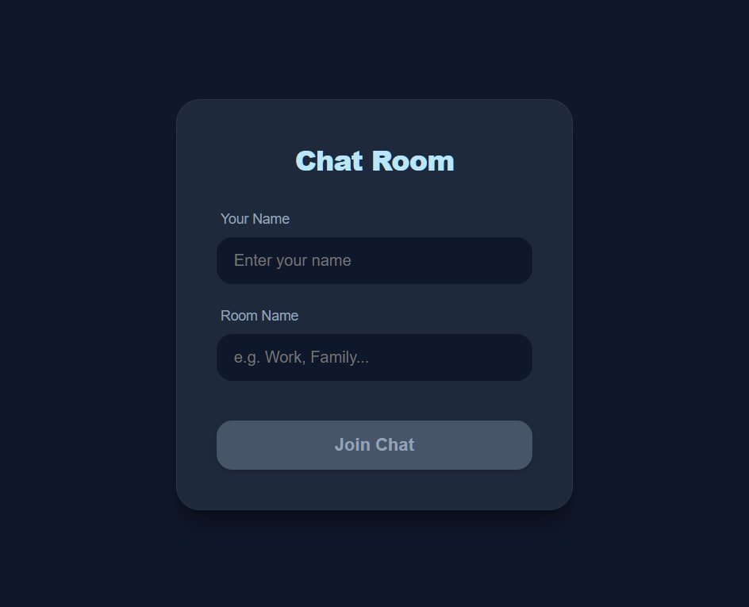
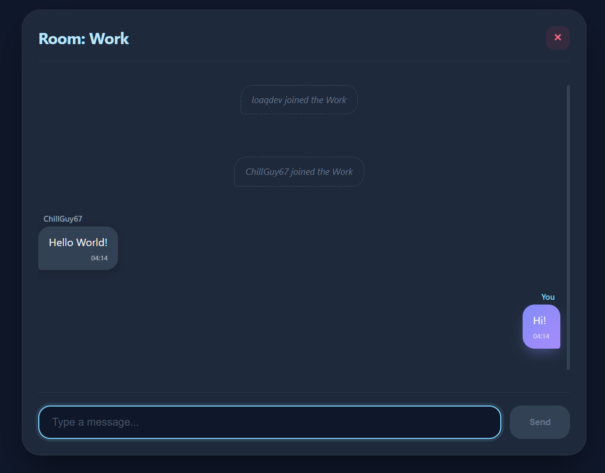

# 💬 Real-Time SignalR Chat

A modern, full-stack real-time chat application built with **ASP.NET Core SignalR** and **React**. The project features a sleek, dark-themed UI with pastel accents and uses **Redis** as a backplane for scalability.

---

## 🚀 Tech Stack


---

<p align="center">  
  <kbd>
   
  
  </kbd>
</p>

## ✨ Features

* **Real-Time Messaging**: Instant communication powered by SignalR hubs.
* **Chat Rooms**: Join specific rooms to chat with different groups.
* **Modern UI**: Responsive dark mode design with a "Pastel Soft" aesthetic.
* **Redis Integration**: Distributed messaging support for horizontal scaling.
* **Auto-Scroll**: Smart message window that stays at the bottom on new messages.

---

## 🛠️ Getting Started

### Prerequisites
* [.NET 8.0 SDK](https://dotnet.microsoft.com/download)
* [Node.js](https://nodejs.org/) (v18+)
* [Docker Desktop](https://www.docker.com/products/docker-desktop/)

### 1. Start Redis (Infrastructure)
The project uses Redis for message handling. Start it using Docker:
```bash
docker compose up -d
```

### 2. Setup Backend
1. Navigate to the backend folder:
```bash
cd backend
```
2. Restore and run the project:
```bash
dotnet run
```
*The API will be available at http://localhost:5174 (or your configured port).*

### 3. Setup Frontend
1. Open a new terminal and navigate to the frontend folder:
```bash
cd frontend
```
2. Install dependencies:
```bash
npm install
```
3. Start the React app:
```bash
npm start
```
*The app will open at http://localhost:3000.*

## 📝 Configuration
To change the Redis connection or CORS settings, check:
- Backend: appsettings.json
- Frontend: SignalR connection URL in your chat service/component.
```json
"ConnectionStrings": {
  "Redis": "localhost:6379"
}
```

